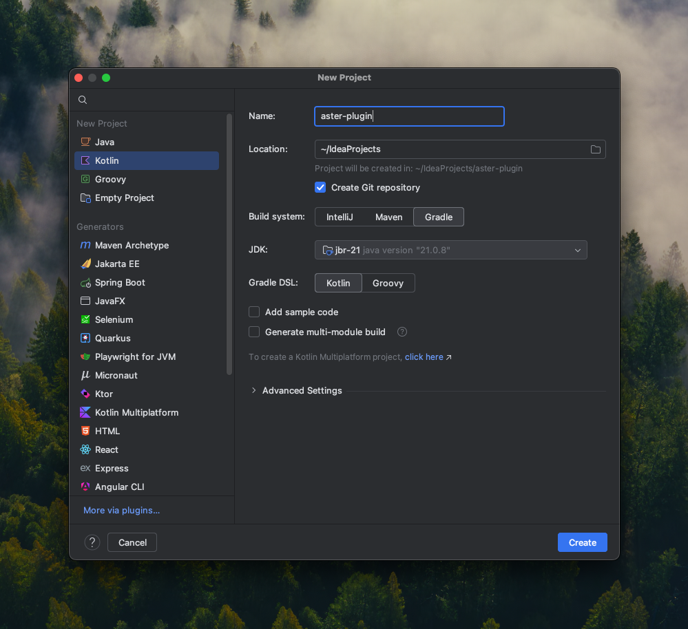

# Plugin Development

Creating a plugin for Aster is relatively simple. You can write a plugin for Aster in Kotlin (recommended) or Java.
Other JVM languages like Scala are also supported, but you'll need to include the standard library and other language
specific necessities.

## Getting Started

In IntelliJ IDEA, create a new Kotlin (or Java, or Scala, or any other JVM language) project. Whatever you name it
doesn't matter, the plugin manifest will determine what's shown in Aster.

Make sure to use Gradle and at least Java 21, any runtime.



Once your project is made, find a file named `build.gradle.kts`. Inside of that, you'll find a repositories block. Add
the two `remlit.site` repositories like shown below.

```kotlin
repositories {
	mavenCentral()
	maven {
		url = uri("https://repo.remlit.site/releases")
	}
	maven {
		url = uri("https://repo.remlit.site/snapshots")
	}
}
```

Also in that file, you'll add Aster as a dependency so you can access its APIs. Make sure it's `compileOnly`, otherwise
your jar will be needlessly large and potentially not work. Make sure to specify the latest version.

```kotlin
dependencies {
	compileOnly("site.remlit.blueb:aster:${aster - version}")
}
```

Now after editing your project build file, click the Gradle reimport button.


## Creating a main class

In `src/main/kotlin`, create a main class. You should name it based on your plugin's name, (e.g. `TestPlugin.kt`). Your
project should look like it does below.


Inside your main class, you'll need to make your main class extend the `AsterPlugin` interface and implement the
`enable()` and `disable()` methods.

```kotlin
class TestPlugin : AsterPlugin {
	override fun enable() {
		println("Hello from TestPlugin")
	}

	override fun disable() {}
}
```

## Creating a plugin manifest

Without a plugin manifest, Aster's plugin loader doesn't know where to look for the main class in your jar. Add a file
named `manifest.json` in `src/main/resources`.


In here, you can set the name of your plugin and the authors to whatever you want. The main class line is the most
important, though. The last part of it is the name of the class, in my case `TestPlugin`. The part after is the artifact
name, `testPlugin`, and the group, `site.remlit.blueb`. Your group can be whatever your want, typically it's an inverted
domain. Mine is `site.remlit` because I own https://remlit.site.

```json
{
  "name": "TestPlugin",
  "mainClass": "site.remlit.blueb.testPlugin.TestPlugin",
  "authors": [
    "blueb"
  ]
}
```

Now when you compile this with `./gradlew clean build`, you should find a jar in `build/libs` that you can drop in the
plugins folder.